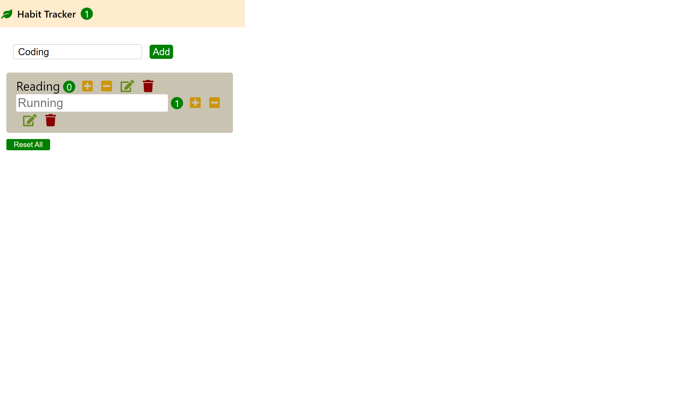

# Havit tracker

# About

## &nbsp;&nbsp; 취미목록 추가와 수정 및 취미 횟수 표시 및 목록 삭제 기능을 만들었습니다.

## &nbsp;&nbsp; 리액트의 기본 문법과 응용력을 기르는데 목적을 둔 프로젝트입니다.

<br />

# demo image



# works

- 취미 목록 추가, 수정 및 삭제 기능구현
- 취미 횟수 (증가 또는 감소) 및 현재 진행중인 취미 목록 개수 표시
- css 스타일을 따로 구현

<br />

# Built width

- react-app (CRA)
- @fortawesome/fontawesome-free

<br />

# Getting Started

## before you start

아래 것들이 설치되어있는 지 확인하세요!

- Nodejs 설치

- npm 또는 yarn

## Project installation and start

- Install npm, yarn

### [ npm ]

```bash
   npm install
```

### [ yarn ]

```bash
   yarn install
```

<br/>

## Start project

### [ npm ]

```bash
   npm start
```

### [ yarn ]

```bash
   yarn start
```
